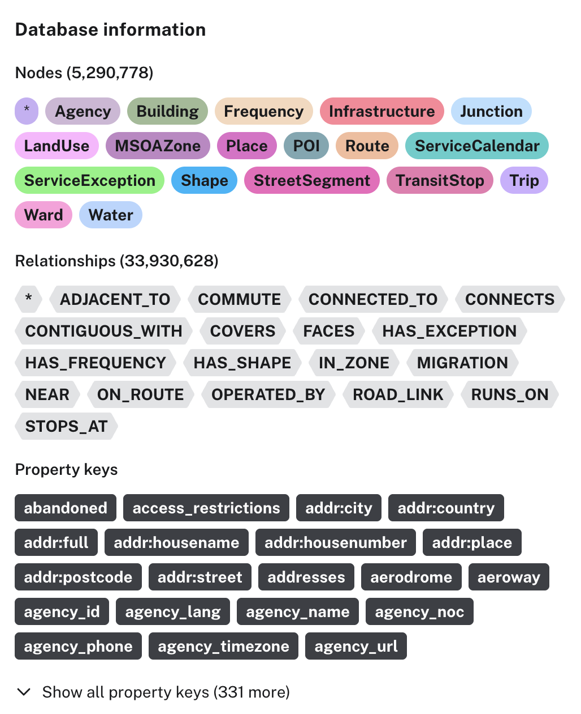

# London Map (city2graph → Neo4j)

A self-contained loader that builds one rich, spatially-coherent, Greater-London-wide map in
Neo4j by combining several [city2graph](https://city2graph.net) pipelines plus OSM/Overture/ONS
sources. The script to load the data is **`load_full.py`**.

## What it builds

| Layer | Source | Nodes (key) | Relationships |
|-------|--------|-------------|---------------|
| Transit | TfL/BODS GTFS (bus, tube, DLR, tram, river, cable car) → `travel_summary_graph` | `:TransitStop (stop_id)` | `(:TransitStop)-[:CONNECTS]->(:TransitStop)` |
| Rail | GB National Rail GTFS, filtered to London Overground + Elizabeth line | (same labels: `:TransitStop`, `:Route`, `:Trip`, …) | (same: `STOPS_AT`, `ON_ROUTE`, `CONNECTS`, …) |
| Full timetable | GTFS (London-clipped) | `:Agency`, `:Route`, `:Trip`, `:ServiceCalendar`, `:Shape`, `:Frequency`, `:ServiceException` | `STOPS_AT`, `ON_ROUTE`, `OPERATED_BY`, `RUNS_ON`, `HAS_SHAPE`, `HAS_FREQUENCY`, `HAS_EXCEPTION` |
| Zones + migration | ONS MSOA boundaries + Census 2021 OD migration/commuting → `od_matrix_to_graph` | `:MSOAZone (MSOA21CD)` | `(:MSOAZone)-[:MIGRATION]->(:MSOAZone)`, `(:MSOAZone)-[:COMMUTE {count}]->(:MSOAZone)` |
| Urban form | Overture Maps → `morphological_graph` | `:Building (place_id)`, `:StreetSegment (movement_id)` | `:Building-[:ADJACENT_TO]->:Building`, `:StreetSegment-[:CONNECTED_TO]->:StreetSegment`, `:Building-[:FACES]->:StreetSegment` |
| Street network | Overture connectors → `segments_to_graph` | `:Junction (junction_id)` | `(:Junction)-[:ROAD_LINK]->(:Junction)` |
| Wards | London Datastore 2018 wards → `contiguity_graph` | `:Ward (GSS_CODE)` | `(:Ward)-[:CONTIGUOUS_WITH]->(:Ward)` (queen adjacency, stored once per pair), `(:Ward)-[:COVERS]->(:TransitStop)` |
| POIs | OSM (Geofabrik `.osm.pbf` via `pyrosm`) + Overture `place` | `:POI (poi_id)`, `:Place (place_key)` | `(:POI)-[:NEAR {distance_m}]->(:TransitStop)` (nearest stop), `IN_ZONE` |
| Extra themes | Overture | `:LandUse`, `:Water`, `:Infrastructure` (`feature_id`) | `IN_ZONE` |

The layers are unified by MSOA zones: every stop, building, street segment, junction, POI,
Overture place, and extra-theme feature is spatially joined into its containing zone via
`(...)-[:IN_ZONE]->(:MSOAZone)`. Wards add a second (administrative) geography over the same stops
via `COVERS`.

> POI note: `:POI` (OSM) and `:Place` (Overture) are kept as separate labels (distinct sources/schemas,
> not de-duplicated against each other). Query all POIs with `MATCH (n) WHERE n:POI OR n:Place`.

> Rail note: London Overground + Elizabeth line are National Rail services (absent from the BODS
> feed), so they come from a separate GB National Rail GTFS and merge onto the same transit model.
> Their stations use NaPTAN `9100…` ids (disjoint from bus `490…`/tube `940…`); all ids are kept native
> (verified collision-free). Find them via the agencies `Elizabeth line` and the six Overground
> line-brands (`Liberty`, `Lioness`, `Mildmay`, `Suffragette`, `Weaver`, `Windrush`). Unlike the rest
> of the map, the whole lines are kept (stations beyond Greater London — Reading, Shenfield,
> Watford Jn, Cheshunt … — are included with coordinates + rail connections, but have no `IN_ZONE`/
> `COVERS` since there are no MSOA zones/wards outside London).

**Complete data.** Every column produced by city2graph is carried onto the
nodes/edges verbatim. Conversions only: each geometry column → a `<name>_wkt` string (WGS84;
e.g. `geometry_wkt`, `building_geometry_wkt`, `tessellation_geometry_wkt`, `segment_geometry_wkt`,
`barrier_geometry_wkt`), and nested structures (`names`, `sources`, `connectors`, …) →
JSON strings (Neo4j can't store nested maps natively). Node keys are the native c2g identifiers.
Each node additionally gets a Neo4j `point` (`location`/`centroid`, WGS84) plus `lon`/`lat`;
`:Building` also gets derived `area`/`perimeter`/`compactness` (the morphology example's features).
Edges keep their full attributes too (e.g. `CONNECTS` → `travel_time_sec`, `frequency`;
`MIGRATION` → `Count`, `weight`).

**Property types.** Scalar properties are stored with their proper Neo4j types, not as strings:
coordinates (`lon`/`lat`, `stop_lat`/`stop_lon`) and metric/morphometric values are `Float`;
GTFS enum/flag codes (`route_type`, `location_type`, `wheelchair_boarding`, `wheelchair_accessible`,
`direction_id`, `exact_times`, `exception_type`, `ServiceCalendar.monday…sunday`), `Building.enclosure_index`,
and Overture `level` are `Integer`; Overture flags (`Building.is_underground`/`has_parts`,
`Water.is_intermittent`/`is_salt`) are `Boolean`. The coercion vocabulary lives in
`neo4j_loader.coerce_expr`; per-label specs are the `numeric` dicts in `load_full.py`. GTFS
clock fields (`arrival`/`departure`/`start_time`/`end_time`) stay strings because GTFS allows
values past `24:00:00`; service dates (`YYYYMMDD`) stay strings; WKT geometry stays a string
(OGC standard, self-describing, lossless — Neo4j has no native polygon/line type). Free-text OSM
`:POI` tags remain strings, as in OSM.

### Map coverage
- **Greater London only.** Transit, full timetable, MSOA zones (~1000, clipped to the GLA boundary),
  migration/commuting, wards, POIs and Overture themes all cover Greater London.
- **All-GL buildings & streets with full morphology**, computed by tiling Greater London into its
  **33 boroughs** (dissolved from the ward shapefile). Each borough is processed independently with
  a `BOROUGH_BUFFER_M` overlap for tessellation context; a building/street is *owned* by the borough
  containing its centroid (ids prefixed `LB_GSS_CD:…`), and `ADJACENT_TO`/`FACES`/`CONNECTED_TO`
  edges are kept between same-borough core features. (Trade-off: a small number of adjacency edges
  that cross a borough boundary are dropped — the only approximation vs. a single global tessellation,
  which is infeasible at ~3–4 M buildings.) Resumable per borough via `_done_<code>` markers.

## Data sources (cached under `data/`)

Licences below are those of the **upstream datasets**. Because OSM and several Overture themes are
ODbL, a public graph built from this pipeline is a derived database: attribute OSM/Overture and
keep those layers share-alike under [ODbL 1.0](https://opendatacommons.org/licenses/odbl/).

| Source | URL / access | Licence | Comment |
|--------|--------------|---------|------------------------|
| BODS London GTFS (bus, tube, DLR, tram, river, cable car) | https://data.bus-data.dft.gov.uk/timetable/download/gtfs-file/london/ | [UK OGL v3.0](https://www.nationalarchives.gov.uk/doc/open-government-licence/version/3/) for DfT BODS ([docs](https://data.bus-data.dft.gov.uk/guidance/requirements/): freely available, no extra click-through). TfL-originated services also fall under the [TfL Transport Data Service licence](https://tfl.gov.uk/corporate/terms-and-conditions/transport-data-service) (OGL v2.0-based, with TfL conditions). | Contains public sector information licensed under the Open Government Licence v3.0. Powered by TfL Open Data. Contains OS data © Crown copyright and database rights 2016. |
| National Rail GTFS (Overground + Elizabeth line), NaPTAN-geocoded | https://storage.travelwhiz.app/generated-gtfs/gb-nationalrail.gtfs.zip ([TravelWhiz](https://github.com/travelwhiz-ltd/GB-Bus-Train-Metro-GTFS)) | Feed compilation: [CC BY 4.0](https://creativecommons.org/licenses/by/4.0/). Upstream: National Rail passenger timetable [CC BY 2.0 UK](https://creativecommons.org/licenses/by/2.0/uk/) (RSP); stop locations [NaPTAN, UK OGL v3.0](https://www.data.gov.uk/dataset/naptan); shapes from OSM are [ODbL 1.0](https://www.openstreetmap.org/copyright). | TravelWhiz GTFS (CC BY 4.0). Contains information from National Rail / RSP. Contains public sector information (NaPTAN) licensed under the Open Government Licence v3.0. © OpenStreetMap contributors. |
| Overture Maps (via `city2graph` / `overturemaps`) | per-borough bboxes for morphology/junctions; Greater-London bbox for `place` / themes | Mixed by theme ([Overture attribution](https://docs.overturemaps.org/attribution/)): **Buildings** and **Transportation** (segments, connectors) **ODbL**; **Base** (`land_use`, `water`, `infrastructure`) **ODbL**; **Places** [CDLA Permissive 2.0](https://cdla.dev/permissive-2-0/) plus [Apache 2.0](https://www.apache.org/licenses/LICENSE-2.0) for Foursquare-sourced records. | Overture Maps Foundation. © OpenStreetMap contributors (ODbL themes). Foursquare-sourced places: Copyright 2024 Foursquare Labs, Inc. (Apache 2.0). |
| MSOA 2021 boundaries | ONS Open Geography Portal, London bbox (~1200 zones, then clipped to GLA). Service: `Middle_layer_Super_Output_Areas_December_2021_Boundaries_EW_BGC_V3` | [UK OGL v3.0](https://www.nationalarchives.gov.uk/doc/open-government-licence/version/3/) (ONS Open Geography; contains OS and ONS IPR) | Source: Office for National Statistics, licensed under the Open Government Licence v.3.0. Contains OS data © Crown copyright and database right. |
| Census 2021 migration | https://www.nomisweb.co.uk/output/census/2021/odmg01ew.zip → `ODMG01EW_MSOA.csv` | [UK OGL v3.0](https://www.nationalarchives.gov.uk/doc/open-government-licence/version/3/) ([Nomis copyright](https://www.nomisweb.co.uk/home/copyright.asp); [ONS OD user guide](https://www.ons.gov.uk/peoplepopulationandcommunity/populationandmigration/populationestimates/methodologies/userguidetocensus2021origindestinationdataenglandandwales)) | Source: Office for National Statistics. Contains public sector information licensed under the Open Government Licence v3.0. |
| Census 2021 commuting | https://www.nomisweb.co.uk/output/census/2021/odwp01ew.zip → `ODWP01EW_MSOA.csv` | Same as migration: [UK OGL v3.0](https://www.nationalarchives.gov.uk/doc/open-government-licence/version/3/) | Source: Office for National Statistics. Contains public sector information licensed under the Open Government Licence v3.0. |
| 2018 London wards | London Datastore `statistical-gis-boundaries-london.zip` → `London_Ward_CityMerged.shp` (625 wards) | [UK OGL v3.0](https://www.nationalarchives.gov.uk/doc/open-government-licence/version/3/) and [OS OpenData](https://www.ordnancesurvey.co.uk/licensing/os-opendata-licensing) ([dataset](https://data.london.gov.uk/dataset/statistical-gis-boundary-files-for-london)) | Contains National Statistics data © Crown copyright and database right 2015. Contains Ordnance Survey data © Crown copyright and database right 2015. |
| OSM POIs | Geofabrik `Greater London` `.osm.pbf` via `pyrosm` (amenity, shop, leisure, tourism, office, healthcare, historic, emergency, craft, man_made, public_transport, aeroway, railway, government, military, club, sport, natural, …) | [ODbL 1.0](https://opendatacommons.org/licenses/odbl/) ([Geofabrik](https://www.geofabrik.de/en/data/download.html); [OSM copyright](https://www.openstreetmap.org/copyright)) | © OpenStreetMap contributors |


**Refer to the various data source license and comply with their requirements when using this london-map Neo4j DB.**


## Data Download

Run `uv run python download_data.py` to fetch + cache the GTFS / MSOA / migration / commuting / ward
sources up front (`--force` re-downloads); Overture and the OSM `.pbf` are fetched on demand during
the build and cached.

## Reproducibility

Rebuilding the dataset does **not** guarantee reproducibility. 
Wards, MSOA zones, and Census 2021 migration/commuting are fixed snapshots; everything else is
whatever the publishers are serving that day — BODS and National Rail timetables (updated ~daily),
OSM POIs (Geofabrik, ~daily), and Overture buildings/streets/places/themes (latest monthly release,
not pinned). Two runs therefore differ in stop lists, trip times, POIs, and building footprints.
Reuse the same files under `data/` if you need to match a previous snapshot.

## Setup
```bash
uv sync                         # Python 3.11–3.13
cp .env.example .env && $EDITOR .env   # set NEO4J_* for your target DB
```

## Run
```bash
# Full build + load.
uv run python load_full.py --reset 2>&1 | tee data/full_run.log

# After an interrupted *build*: rerun the same command. Cached downloads and
# per-borough `_done_<code>` markers are reused; `--reset` still wipes Neo4j
# then reloads from the staged CSVs. There is no separate resume flag.
uv run python load_full.py --reset

# Useful flags:
#   --skip-build        load already-staged CSVs only
#   --skip-load         build/stage CSVs only
#   --max-boroughs N    limit morphology and junction boroughs (testing)
#   --only PHASES       comma list of build phases: migration, transit,
#                       gtfs_extras, morphology, junctions, commuting, place,
#                       pois, themes, cross, rail
#                       (zones + wards always run; they are cheap dependencies)
```
Tip: for much faster local loading, raise Neo4j Desktop's heap/page-cache before running.

The same scripts load into either a local Neo4j or a remote AuraDB, chosen automatically from
`NEO4J_URI`.
Set credentials in `.env` (`NEO4J_URI`, `NEO4J_USERNAME`, `NEO4J_PASSWORD`, `NEO4J_DATABASE`).

We also provide a .backup file that's a snapshot of an existing 2026.08 Neo4j DB containing the data, hosted at the public S3 bucket: `s3://gds-public-dataset/neo4j-2026-09-21T-london-map-db.backup`. You can use Neo4j's restore functionality to load this .backup into your DB.

Graph schema:



